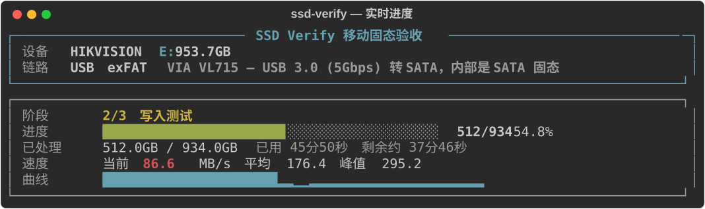
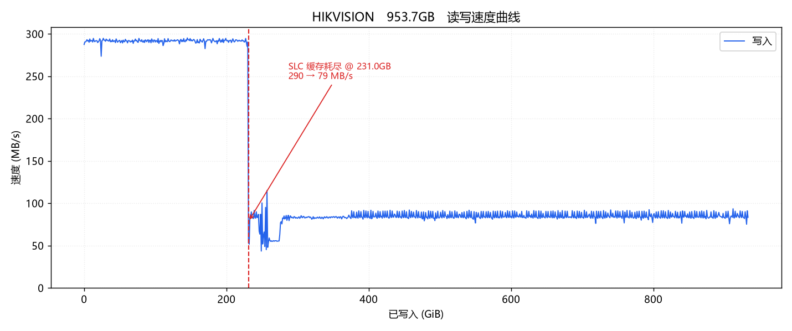
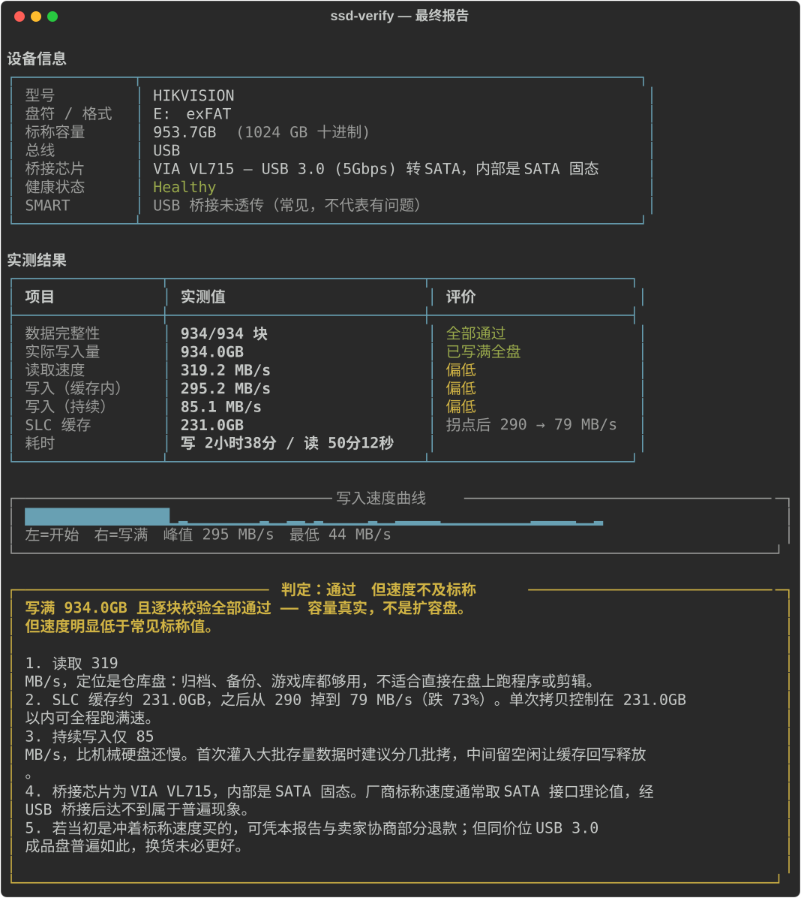

# ssd-verify

**新买的移动固态到手，一条命令查清它有没有骗你。**

检测扩容盘（虚标容量）、实测真实读写速度、找出 SLC 缓存拐点，最后按实测数据给出「留还是退」的判定和使用建议。

不需要下载任何第三方 exe，不需要管理员权限，测完自动清理、空间完整归还。

<p align="center">
  
</p>

---

## 为什么需要这个

网购的移动固态有两类常见问题，**都不是插上看一眼容量就能发现的**：

**一、扩容盘。** 把 64GB 的盘改固件报成 1TB。系统里显示 1TB，前 64GB 写进去也正常，超过之后主控把地址悄悄绕回盘的开头，新数据覆盖旧数据。文件管理器里看着文件都在、大小也对，**打开全是损坏的**。等你发现时早过了退货期。

唯一可靠的检测方式是**写满全盘再逐块读回校验**。本工具给每块写入唯一可辨认的内容（块头 + 16 个散布哨兵），一旦发生覆盖，读回来时序号对不上，立刻暴露。

**二、速度虚标。** 标称 560MB/s 的盘，实测可能只有一半。原因往往不是造假而是口径不同：很多成品盘内部是 SATA 固态 + USB 桥接，厂商标的是 SATA 接口理论值，经桥接后根本达不到。本工具会读出桥接芯片型号并直接告诉你这一点。

还有一个更隐蔽的：**SLC 缓存耗尽后的掉速**。多数消费级固态用一小块高速缓存扛前几十上百 GB，写满后暴跌。下图是实测的一块海康威视 WIND 1TB——前 231GB 跑 290MB/s，之后直接掉到 **79MB/s，比机械硬盘还慢**：

<p align="center">
  
</p>

这种特性买之前没人会告诉你，但它决定了你往盘里灌 500GB 素材要花 40 分钟还是 3 小时。

---

## 安装

需要 Python 3.10+，Windows 平台。

```bash
git clone https://github.com/FuzzyLogic112/ssd-verify.git
cd ssd-verify
pip install -r requirements.txt
```

## 使用

最简单的方式是直接运行，它会列出所有可测磁盘让你选：

```bash
python verify_ssd.py
```

也可以直接指定：

```bash
python verify_ssd.py --drive E: --mode full
```

| 模式 | 写入量 | 1TB 耗时 | 能查出什么 |
|---|---|---|---|
| `quick` | 约 20 GiB | 2–5 分钟 | 速度、缓存表现。**查不出扩容盘** |
| `full` | 写满全盘 | 2–3 小时 | 全部，**包括扩容盘** |

**新买的盘请用 `full`。** 扩容盘的覆盖只在写超真实容量后才发生，写一半是验不出来的。

中断后清理残留文件：

```bash
python verify_ssd.py --drive E: --clean
```

<details>
<summary>全部参数</summary>

```
--drive E:        盘符，不给则交互式选择
--mode quick|full 测试模式，不给则交互式选择
--out DIR         报告输出目录，默认 ./reports
--limit-gb N      限制写入量，用于自测
--yes             跳过确认，用于脚本化调用
--clean           只清理残留测试文件夹
```
</details>

---

## 结果怎么看

跑完会输出设备信息、实测结果、速度曲线和判定建议：

<p align="center">
  
</p>

同时导出 JSON 结果和速度曲线 PNG 到 `reports/`，可作为找卖家理论的凭证。

### 判定标准

| 判定 | 含义 |
|---|---|
| **通过** | 容量真实、速度正常，放心用 |
| **通过但速度不及标称** | 容量真实，但读写明显低于宣传值 |
| **未完整验证** | 没写满全盘，扩容盘尚未排除 |
| **不通过** | 校验出坏块，**立即退货** |

### 各项指标

**数据完整性** —— 唯一的硬指标，**必须 0 坏块**。有任何一块对不上就是扩容盘或坏盘，不要犹豫，直接退。

**实际写入量** —— 全盘模式下应接近标称容量。注意标称 1TB 的盘在系统里显示约 931GiB 是正常的（厂商按 10³ 算、系统按 2¹⁰ 算），不是缺斤少两。

**读取速度** —— 800+ 可当外接工作盘；400–800 适合游戏库和素材调取；低于 400 建议只当仓库盘。

**写入（持续）** —— SLC 缓存耗尽后的速度，比峰值更能代表真实体验。低于 100MB/s 意味着灌大批数据时会很痛苦，建议分批拷、中间留空闲让缓存回写。

**SLC 缓存** —— 单次拷贝控制在这个量以内就能全程跑满速。

---

## 它是怎么工作的

```
┌─ 1. 探测设备 ──────────────────────────────────────┐
│  型号 / 容量 / 文件系统 / 健康状态                  │
│  用磁盘序列号匹配出 USB 桥接芯片 VID:PID            │
│  → 判断内部是 SATA 还是 NVMe、链路是 5 还是 10Gbps  │
└────────────────────────────────────────────────────┘
                        ↓
┌─ 2. 写入测试 ──────────────────────────────────────┐
│  逐块写入 1GiB，每块带唯一块头 + 16 个散布哨兵      │
│  每块写完 fsync 强制落盘，记录真实速度              │
│  → 得到完整速度曲线，据此定位 SLC 缓存拐点          │
└────────────────────────────────────────────────────┘
                        ↓
┌─ 3. 读回校验 ──────────────────────────────────────┐
│  用 FILE_FLAG_NO_BUFFERING 绕过系统缓存直读         │
│  逐块比对块头序号和 16 个哨兵                       │
│  → 任何地址回绕、覆盖、截断都会在这里暴露           │
└────────────────────────────────────────────────────┘
```

### 几个容易做错的地方

这些都是实际踩过的坑，写在这里省得别人重蹈覆辙：

**读取必须绕过系统缓存。** Windows 会把刚写入的数据留在文件缓存里，直接 `open()` 读回来读的是内存副本——实测能跑出 1720MB/s，而这块盘真实只有 319MB/s。`buffering=0` 只关掉 Python 层缓冲，关不掉操作系统的，必须用 `FILE_FLAG_NO_BUFFERING`。

**测试数据的生成速度不能成为瓶颈。** 每块现场生成 1GiB 伪随机数据只有约 40MB/s，比被测硬盘还慢，测出来的就成了 CPU 性能。本工具一次性生成 16MiB 随机基块后平铺复用，每块只改写块头和哨兵，生成成本趋近于零。

**测试数据必须不可压缩。** 否则带透明压缩的主控可以少写实际数据，虚报速度。基块是真随机的，每个 4K 扇区都不可压缩。

**光看块头不够。** 若扩容盘的回绕粒度大于块大小，块头可能恰好躲过覆盖。所以每块还散布 16 个哨兵，把检测粒度降到 64MiB。

**识别桥接芯片不能取第一个 USB 设备。** 机器上通常挂着一堆键鼠外设，直接取第一个带 `VID_` 的会张冠李戴——报错的硬件信息比不报更糟。本工具用磁盘序列号去匹配对应的 USB 设备。

---

## 安全性

- 只在目标盘新建 `__ssd_verify__` 文件夹，**不会删除或修改你已有的文件**
- 拒绝在系统盘上运行
- 测试结束（含中断）后清理全部测试文件，空间完整归还
- 不需要管理员权限，不安装任何东西，不联网

`full` 模式会写满全盘，这是检测扩容盘的必要代价。一次全盘写入对固态寿命的消耗约等于 0.1% 不到的 TBW，用一次验收没有问题。

---

## 开发

```bash
python test_verify.py      # 34 项回归测试
```

测试用例覆盖块生成唯一性、扩容盘回绕检测、中段覆盖、截断、SLC 拐点识别、桥接芯片识别和判定逻辑。改动核心逻辑后务必跑一遍。

README 插图由 `tools/make_assets.py` 生成，数据来自一次真实的 1TB 全盘测试。

---

## 局限

- **仅支持 Windows**。设备探测依赖 PowerShell，直读依赖 Win32 API。
- 哨兵间隔 64MiB，**不检测随机单比特翻转**——那类错误由固态自身的 ECC 负责，本工具针对的是 MB/GB 级的地址回绕。
- SMART 信息取决于 USB 桥接芯片是否透传，读不到属正常现象，不代表盘有问题。
- 全盘测试期间请勿拔盘或让电脑休眠。

## License

MIT
